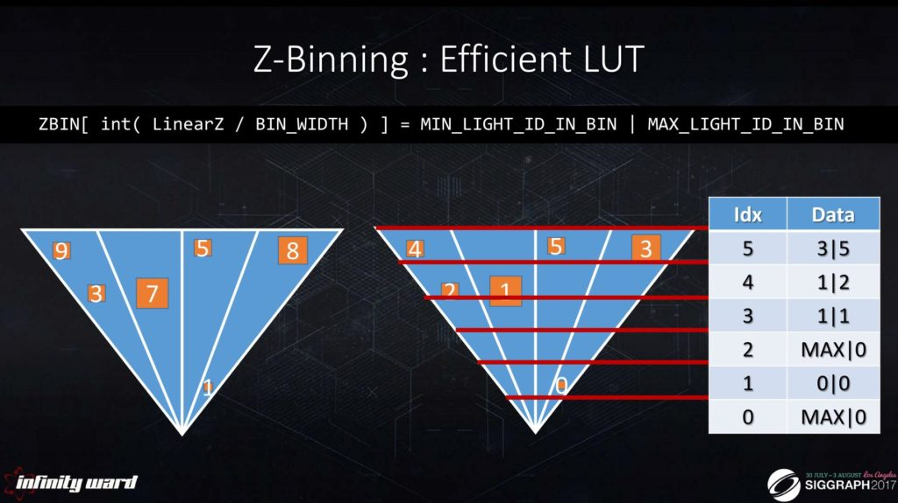

WebGL Forward+ and Clustered Deferred Shading
======================

**University of Pennsylvania, CIS 565: GPU Programming and Architecture, Project 4**

* H1yori233
  * [Github](https://github.com/H1yori233)
  * https://h1yori233.github.io
  * https://www.linkedin.com/in/kaiqin-kong-4709b0357/
* Tested on: **Google Chrome 137.0.7107.0, canary** on Windows 11, AMD Ryzen 7 5800H @ 3.20GHz 16GB, RTX 3050 Laptop 4GB

### Live Demo

[](https://h1yori233.github.io/WebGPU-Forward-Plus-and-Clustered-Deferred/)

### Demo Video/GIF

[](TODO)

## Project Overview

This project implements three different rendering techniques:
1. **Naive Forward Rendering** - Traditional forward rendering
2. **Forward+ (Tiled Forward) Rendering** - Tile-based forward rendering
3. **Clustered Deferred Rendering** - Clustered deferred rendering

The project uses WebGPU technology to demonstrate the implementation and performance comparison of modern GPU rendering pipeline lighting optimization techniques.

## Technical Implementation

### Forward+ Rendering


Forward+ rendering optimizes lighting calculations by dividing screen space into multiple frustums (clusters). Key features:

- **Spatial Subdivision**: Divides the view frustum into a 16x9x24 3D grid
- **Light Culling**: Tests light-cluster collision detection in compute shaders
- **Index Storage**: Only stores light indices that affect each cluster, avoiding unnecessary lighting calculations

Core implementation files:
- `src/renderers/forward_plus.ts` - Forward+ renderer
- `src/shaders/clustering.cs.wgsl` - Clustering compute shader
- `src/shaders/forward_plus.fs.wgsl` - Forward+ fragment shader


### Clustered Deferred Rendering

Combines clustering techniques with deferred rendering for further performance optimization:

**G-Buffer Design**:
- Uses a single `rgba32uint` texture to store all geometric information
- Normals compressed to 2 components using Octahedron encoding
- Positions reconstructed from depth values and camera inverse matrix

**Rendering Pipeline**:
```
Geometry Pass -> G-Buffer Generation -> Fullscreen Lighting
```

Compared to traditional methods, reduces redundant triangle-light calculations:

From:
```cpp
for each triangle:
    for each light:
        calculate lighting
```

To:
```cpp
for each pixel:
    for each light in cluster:
        calculate lighting
```


Core implementation files:
- `src/renderers/clustered_deferred.ts` - Clustered Deferred renderer
- `src/shaders/clustered_deferred.fs.wgsl` - G-Buffer generation shader
- `src/shaders/clustered_deferred_fullscreen.fs.wgsl` - Fullscreen lighting shader

### G-Buffer Compression Optimization

To reduce memory usage, efficient G-Buffer compression is implemented:

1. **Position Reconstruction**: World coordinates not stored, reconstructed from depth values and camera inverse matrix
2. **Normal Compression**: Uses Octahedron normal vector encoding to compress 3D normals to 2D
3. **Data Packing**: All data packed into a single `rgba32uint` texture

Compression format:
- R channel: Compressed normal (2x16bit)
- G channel: Depth + Diffuse R (2x16bit)  
- B channel: Diffuse GB (2x16bit)
- A channel: Reserved

### Z-binning Optimization


Implements Z-binning technique to further optimize clustering performance:

- **Light Sorting**: Sorts lights by view space depth
- **Depth Binning**: Pre-computes light ranges for each Z level
- **Range Limiting**: Only considers lights within specific depth ranges during clustering

Core implementation:
- `src/shaders/z_binning.cs.wgsl` - Z-binning compute shader
- `src/shaders/bitonic_sort_lights.cs.wgsl` - Light sorting shader

### Credits

- [Vite](https://vitejs.dev/)
- [loaders.gl](https://loaders.gl/)
- [dat.GUI](https://github.com/dataarts/dat.gui)
- [stats.js](https://github.com/mrdoob/stats.js)
- [wgpu-matrix](https://github.com/greggman/wgpu-matrix)

### Reference
- [A Primer On Efficient Rendering Algorithms & Clustered Shading](https://www.aortiz.me/2018/12/21/CG.html)
- [Clustered shading evolution in Granite](https://themaister.net/blog/2020/01/10/clustered-shading-evolution-in-granite/)
- [Forward+ Rendering and Tiled Deferred Shading](https://takahiroharada.files.wordpress.com/2015/04/forward_plus.pdf)
- [Octahedron Normal Vector Encoding](https://knarkowicz.wordpress.com/2014/04/16/octahedron-normal-vector-encoding/)