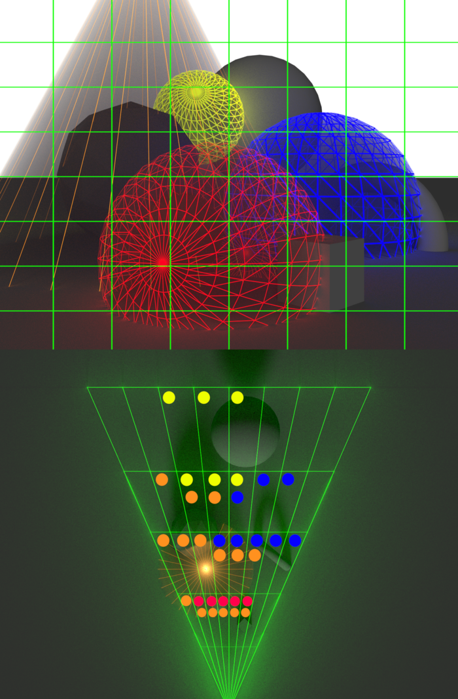
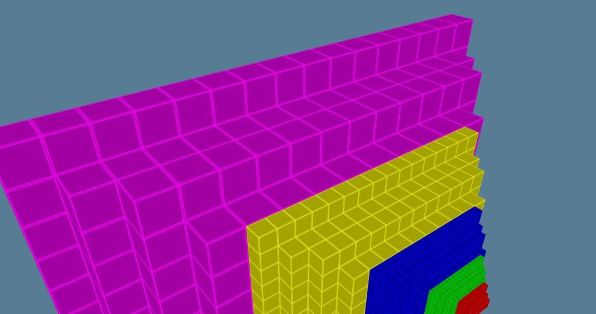
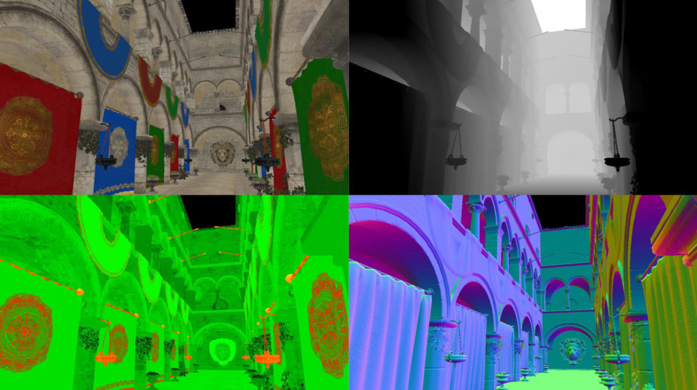

WebGPU Forward+ and Clustered Deferred Shading
======================

**University of Pennsylvania, CIS 565: GPU Programming and Architecture, Project 4**
* H1yori233
  * [Github](https://github.com/H1yori233)
  * h1yori233.github.io
  * https://www.linkedin.com/in/kaiqin-kong-4709b0357/
* Tested on: **Google Chrome 137.0.7107.0, canary** on Windows 11, AMD Ryzen 7 5800H @ 3.20GHz 16GB, RTX 3050 Laptop 4GB

---

## 🌐 [Live Demo](https://h1yori233.github.io/WebGPU-Forward-Plus-and-Clustered-Deferred/)

## Features Implemented

✅ **Core Rendering Methods**
- Naive Forward Rendering
- Forward+ Rendering with Light Clustering
- Clustered Deferred Rendering
- G-Buffer Optimization (Single Texture)

✅ **Advanced Optimizations**
- G-Buffer Data Packing 
- Render Bundles Support
- Post-Processing Pipeline

## 🎬 Demo Video

> *30+ second demonstration showcasing all rendering modes and effects*

---

## 📊 Technical Overview

### Rendering Pipeline Comparison

| Method | G-Buffer | Clustering | Lighting Pass |
|--------|----------|------------|---------------|
| **Naive** | ❌ | ❌ | Per-fragment all lights |
| **Forward+** | ❌ | ✅ | Per-fragment clustered lights |
| **Clustered Deferred** | ✅ Multi-target | ✅ | Fullscreen pass |
| **Optimized Deferred** | ✅ Single texture | ✅ | Fullscreen pass |

### Light Clustering Visualization

*3D Light Clustering*

*Cluster Light Assignment*

### G-Buffer Optimization

**Packed G-Buffer Format:** Single `rgba32uint` texture using `pack2x16snorm`:
- **X Component:** Octahedron-encoded Normal (2x16 bits)
- **Y Component:** Depth + Albedo Red (2x16 bits)
- **Z Component:** Albedo Green + Blue (2x16 bits)
- **W Component:** Available for additional properties

## ⚡ Performance Analysis

### Rendering Method Comparison
i just use 1.0 / fps to calculate right now...

| Configuration | Naive | Forward+ | Clustered Deferred | Optimized Deferred |
|---------------|-------|----------|-------------------|-------------------|
| **500 Lights** | 333.3ms | 45.5ms | 27.0ms | 25.0ms |
| **1000 Lights** | >1000ms | 83.3ms | 34.5ms | 32.3ms |
| **2000 Lights** | >1000ms | 166.7ms | 50.0ms | 47.6ms |

---

## 🛠️ Technical Implementation

### Core Systems

**Light Clustering (Compute Shader)**
- 3D spatial partitioning with screen-space tiling
- Per-cluster light assignment with AABB intersection testing

**G-Buffer Management**
- Multi-render target support for standard deferred
- Single-texture packed format for optimized variant
- Custom encoding/decoding for efficient data storage

**Post-Processing Pipeline**
- Flexible effect chaining architecture
- Support for grayscale and toon shading effects
- Render-to-texture with intermediate buffer management

## Credits

[Vite](https://vitejs.dev/) • [loaders.gl](https://loaders.gl/) • [dat.GUI](https://github.com/dataarts/dat.gui) • [stats.js](https://github.com/mrdoob/stats.js) • [wgpu-matrix](https://github.com/greggman/wgpu-matrix)

## References
- [A Primer On Efficient Rendering Algorithms & Clustered Shading](https://www.aortiz.me/2018/12/21/CG.html)
- [Clustered shading evolution in Granite](https://themaister.net/blog/2020/01/10/clustered-shading-evolution-in-granite/)

